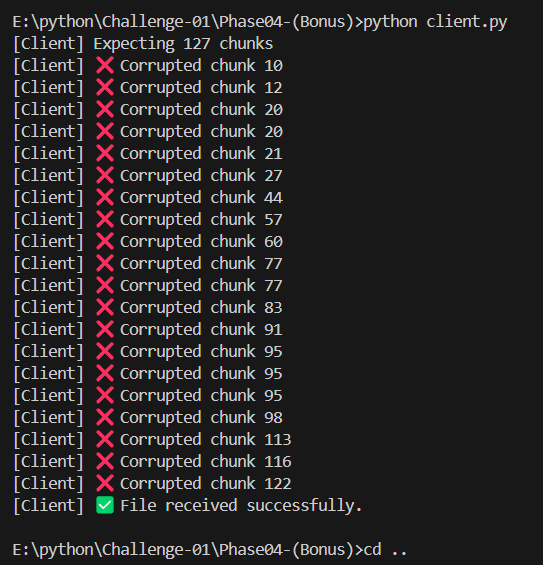
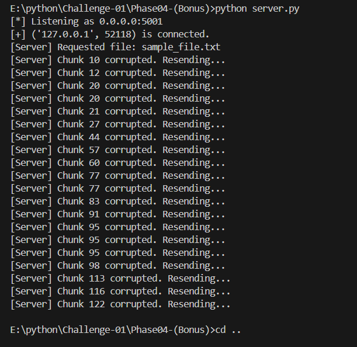

# 📁 Real-Time File Transfer and Verification System

This project demonstrates a client-server architecture to perform reliable file transfer using TCP sockets in Python. It consists of **four development phases**, progressively adding robustness and reliability to the file transfer process, culminating in retransmission mechanisms for corrupted data.

# __✅ Phase04-(Bonus) is the final phase. Run these files to test the complete system.__

---

## 🔧 Phase 1 – Basic File Transfer

- A TCP server and client were implemented.
- The client requests a file from the server.
- The server reads and sends the file to the client in one go.
- The client receives and saves the file.

✅ **Outcome**: File successfully transferred but with no integrity verification.

---

## 🔐 Phase 2 – Chunk-Based Transfer with Checksum

- The server splits the file into fixed-size chunks (e.g., 1024 bytes).
- Each chunk is appended with a **SHA-256 checksum**.
- The client verifies the checksum for each chunk upon receipt.

✅ **Outcome**: Detection of corrupted chunks (simulated manually in this phase), but no retransmission.

---

## 🔄 Phase 3 – Reliable Transfer Using ACK/NACK

- Introduced a communication protocol:
  - **ACK** sent for successfully received chunks.
  - **NACK** sent for corrupted chunks.
- Server waits for acknowledgment before sending the next chunk.
- Retransmission occurs for any chunk that was negatively acknowledged.

✅ **Outcome**: Ensured data integrity using retransmission, achieving reliable file transfer.

---

## 🎯 Phase 4 – Simulated Corruption & Real-Time Retransmission (Bonus)

- Random corruption is **simulated** with a configurable probability (default 20%).
- Server intentionally corrupts chunks before sending.
- Client detects corruption using checksum mismatch.
- Server resends corrupted chunks until valid **ACK** is received.
- Transfer completes only when all chunks are verified.

✅ **Outcome**: Robust real-time file transfer system capable of handling unreliable communication and ensuring complete data integrity.

---

## ⚙️ Configuration

- **Chunk size**: 1024 bytes
- **Checksum**: SHA-256 (64 hex characters)
- **Corruption probability**: Configurable via `CORRUPTION_PROBABILITY` in `server.py`
- **End of transmission**: Signaled with sequence number `-1`

---

## 🗂 Output Example

Client console output :

Server console output :

