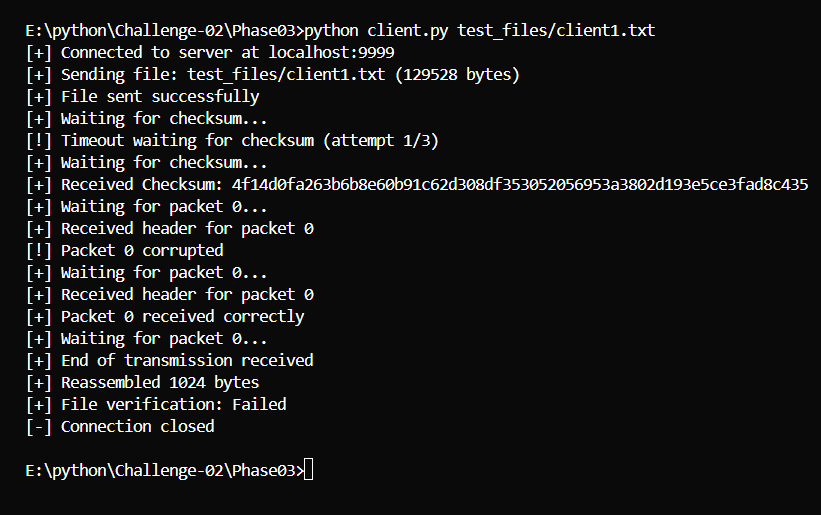
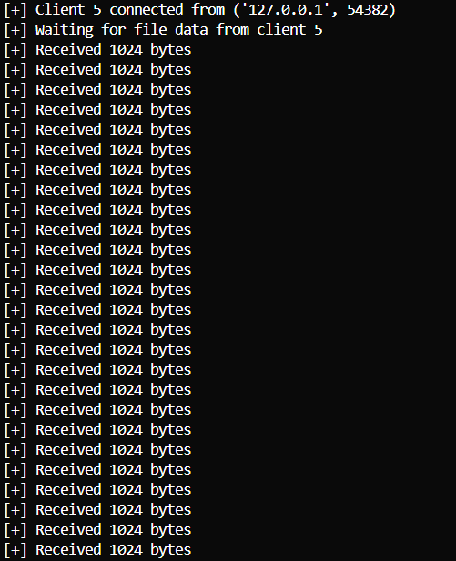

# 📁 Enhanced File Transfer System with Error Simulation

This project implements an advanced client-server architecture for reliable file transfer using TCP sockets in Python. It consists of **three development phases**, progressively adding error simulation, acknowledgment mechanisms, and retransmission logic to ensure reliable data transfer even in unreliable network conditions.

# __✅ Phase03 is the final phase. Run these files to test the complete system.__

---

## 🔧 Phase 1 – Basic File Transfer

- Implemented a TCP server and client for file transfer
- Client sends a file to the server
- Server receives and stores the file
- Basic error handling for connection issues

✅ **Outcome**: Basic file transfer functionality with minimal error handling.

---

## 🔐 Phase 2 – Chunk-Based Transfer with Sequence Numbers

- Server splits the file into fixed-size chunks (1024 bytes)
- Each chunk is tagged with a sequence number and client ID
- Client reassembles chunks in correct order
- SHA-256 checksum verification for file integrity

✅ **Outcome**: Reliable chunk-based transfer with proper ordering and integrity verification.

---

## 🔄 Phase 3 – Error Simulation and Retransmission

- Implemented error simulation:
  - Random packet drops (10% probability)
  - Random packet corruption (5% probability)
- Added acknowledgment mechanism:
  - **ACK** for correctly received packets
  - **NACK** for corrupted packets
- Implemented retransmission logic:
  - Server retries sending packets that receive NACK
  - Maximum retry attempts (3) with timeout
- Enhanced error handling:
  - Timeout detection
  - Connection reset handling
  - Graceful error recovery

✅ **Outcome**: Robust file transfer system capable of handling simulated network errors and ensuring data integrity through retransmission.

---

## ⚙️ Configuration

- **Server Host**: localhost
- **Server Port**: 9999
- **Chunk Size**: 1024 bytes
- **Packet Drop Rate**: 10% (configurable)
- **Packet Corruption Rate**: 5% (configurable)
- **ACK Timeout**: 2.0 seconds
- **Max Retries**: 3 attempts

Configuration can be modified in `config.py`:
```python
SERVER_HOST = "localhost"
SERVER_PORT = 9999
CHUNK_SIZE = 1024
PACKET_DROP_RATE = 0.1  # 10% chance of packet drop
PACKET_CORRUPT_RATE = 0.05  # 5% chance of packet corruption
ACK_TIMEOUT = 2.0  # Timeout in seconds
MAX_RETRIES = 3  # Maximum retransmission attempts
```

---

## 🗂 Usage

1. Start the server:
```bash
python server.py
```

2. Run the client with a file:
```bash
python client.py test_files/client1.txt
```

The system will:
- Transfer the file in chunks
- Simulate network errors
- Handle retransmissions
- Verify file integrity
- Display detailed progress

---

## 🔍 Features

- **Error Simulation**
  - Configurable packet drop rate
  - Configurable corruption rate
  - Realistic network condition simulation

- **Reliable Transfer**
  - Sequence numbering for packet ordering
  - Checksum verification for integrity
  - ACK/NACK for packet status
  - Automatic retransmission

- **Robust Error Handling**
  - Connection timeout detection
  - Connection reset recovery
  - Maximum retry limits
  - Graceful error reporting

- **Progress Monitoring**
  - Detailed transfer progress
  - Error simulation feedback
  - Retransmission statistics
  - Final integrity verification

---

## 🗂 Output Example

Client console output :



Server console output :

